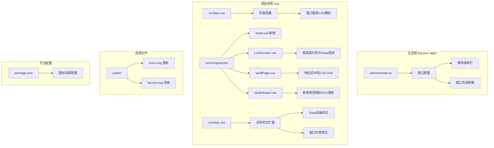
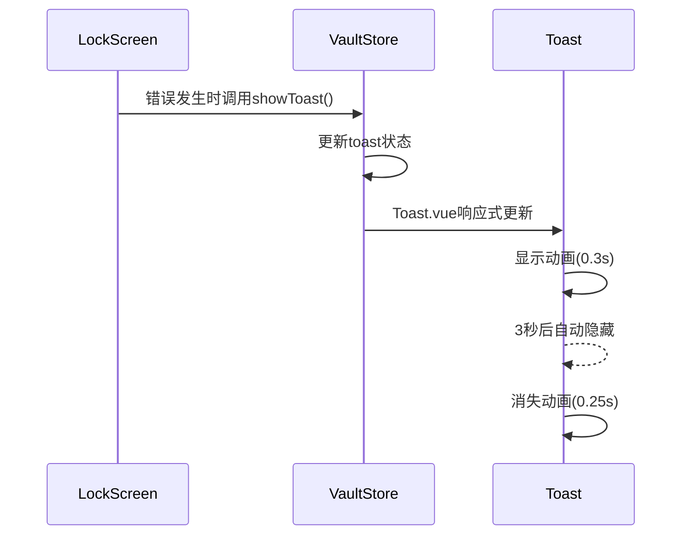

# UI优化架构设计文档

**任务ID**：20260422001  
**设计时间**：2026-04-22  
**架构师**：Architect Agent

---

## 一、架构概览

本任务为PassLock v0.1.0-beta的收尾UI优化，不涉及安全架构或加密模块改动，主要聚焦于前端渲染进程的视觉优化和Electron主进程的窗口配置调整。

### 整体架构图



---

## 二、模块划分与职责边界

### 2.1 涉及模块清单

| 模块 | 文件路径 | 职责 | 改动类型 |
|------|----------|------|----------|
| 主进程窗口 | `electron/main.ts` | 窗口配置、菜单栏移除 | 修改 |
| 全局样式 | `src/style.css` | Toast动画、窗口外观CSS | 修改 |
| 页面容器 | `src/App.vue` | 窗口圆角CSS容器 | 修改 |
| 锁定屏幕 | `src/components/LockScreen.vue` | 错误提示改为Toast调用 | 修改 |
| 密码库页面 | `src/components/VaultPage.vue` | 响应式布局CSS Grid | 修改 |
| 头部组件 | `src/components/VaultHeader.vue` | 新增按钮图标SVG | 修改 |
| Toast组件 | `src/components/Toast.vue` | **新增**通用Toast组件 | 新建 |
| Logo组件 | `src/components/LogoIcon.vue` | **新增**品牌图标组件 | 新建 |
| 资源文件 | `public/icons.svg` | SVG图标源文件 | 更新 |

### 2.2 职责边界定义

**Electron主进程职责**：
- 移除默认菜单栏（`win.setMenu(null)`）
- 配置窗口基础参数（可选：透明背景、圆角API）

**渲染进程职责**：
- CSS模拟窗口圆角和阴影（跨平台兼容）
- Toast组件实现与状态管理
- 响应式布局CSS Grid实现
- 图标SVG更新与组件封装

**不涉及的模块**：
- `electron/crypto.ts` - 加密模块无改动
- `electron/database.ts` - 数据库模块无改动
- `electron/preload.ts` - IPC桥接无新增API
- `src/stores/vault.ts` - 状态管理无新增逻辑（Toast状态已存在）

---

## 三、技术决策与ADR

### ADR-001：窗口外观实现方案

**背景**：UI设计要求窗口圆角16px + 强阴影，但Electron原生API跨平台兼容性差。

**决策**：采用CSS模拟为主方案，Electron原生API作为增强。

**理由**：
- CSS方案跨平台一致性高，可控性强
- Windows 10不支持原生圆角，CSS降级可正常显示
- macOS原生圆角可通过Electron API叠加增强

**实现策略**：
```
方案优先级：CSS模拟 > macOS原生API > Windows 11 DWM API
```

### ADR-002：Toast组件架构方案

**背景**：首屏错误展示需改为Toast浮窗，UI设计提出两种方案。

**决策**：新建独立`Toast.vue`组件，使用`Teleport`渲染到body。

**理由**：
- Toast是通用组件，后续Settings/VaultPage都可使用
- vault.ts已存在Toast状态，无需新增状态管理
- Teleport确保Toast不受父组件overflow影响

**已有状态**（vault.ts 73-78行）：
```typescript
const toast = ref<{ visible: boolean; type: 'success' | 'error'; title: string; details?: string }>({
  visible: false,
  type: 'success',
  title: '',
})
```

**组件职责**：
- `Toast.vue`：UI渲染与动画
- `vault.ts`：状态管理与`showToast()`方法调用

### ADR-003：响应式布局方案

**背景**：当前VaultPage使用固定断点切换（4→3→2→1），跳变明显。

**决策**：采用CSS Grid `auto-fill` + `minmax(240px, 1fr)`方案。

**理由**：
- 原生CSS Grid流畅过渡，无需媒体查询跳变
- `minmax(240px, 1fr)`保证最小宽度240px，内容可读
- `auto-fill`自动计算列数，响应式效果最佳

**实现代码**：
```css
.cards-grid {
  display: grid;
  grid-template-columns: repeat(auto-fill, minmax(240px, 1fr));
  gap: 24px 20px;
  justify-content: center;
  max-width: 1200px;
}
```

### ADR-004：图标资源管理方案

**背景**：产品图标需应用到打包产物、主页面、任务栏等多处。

**决策**：SVG源文件 + PNG多尺寸输出，通过electron-builder配置打包。

**理由**：
- SVG用于Vue组件，颜色可控（CSS变量）
- PNG多尺寸用于打包（electron-builder自动处理）
- `package.json` build配置添加icon路径

**打包配置**：
```json
{
  "build": {
    "icon": "public/icons.png"  // electron-builder从PNG生成各平台图标
  }
}
```

---

## 四、数据流设计

### 4.1 Toast数据流



### 4.2 状态依赖关系

Toast组件依赖vault.ts中的`toast`状态，无需新增状态管理：
- `toast.visible` - 控制显示/隐藏
- `toast.type` - 控制样式（success/error）
- `toast.title` - 主标题
- `toast.details` - 可选详情

---

## 五、实现要点清单

### 5.1 Electron主进程改动

**文件**：`electron/main.ts`

**改动点**：
1. `createWindow()`函数内添加 `win.setMenu(null)` 移除默认菜单栏
2. 可选：添加窗口透明配置（macOS vibrancy增强）

**改动范围**：约5行代码

### 5.2 Toast组件实现

**新文件**：`src/components/Toast.vue`

**实现要点**：
1. 使用`<Teleport to="body">`渲染到body
2. 监听`vaultStore.toast`状态
3. CSS动画：入场0.3s、消失0.25s
4. 支持手动关闭按钮
5. 定位：`fixed; top: 20px; left: 50%; transform: translateX(-50%)`

### 5.3 LockScreen改动

**文件**：`src/components/LockScreen.vue`

**改动点**：
1. 移除现有的`error-box`静态展示（260-265行、311-316行）
2. 错误发生时调用`vaultStore.showToast('error', error.value)`
3. 在App.vue中引入Toast组件（全局使用）

### 5.4 VaultPage改动

**文件**：`src/components/VaultPage.vue`

**改动点**：
1. 替换`.cards-grid` CSS（402-407行）
2. 从固定断点改为`auto-fill`方案
3. 移除响应式媒体查询（453-486行）

### 5.5 VaultHeader改动

**文件**：`src/components/VaultHeader.vue`

**改动点**：
1. 替换新增按钮SVG（55-57行）
2. 使用简洁单笔画加号图标

### 5.6 App.vue改动

**文件**：`src/App.vue`

**改动点**：
1. 添加窗口圆角CSS容器样式
2. 引入Toast组件（全局）

### 5.7 全局样式扩展

**文件**：`src/style.css`

**改动点**：
1. 添加Toast动画样式
2. 添加窗口外观CSS变量

---

## 六、安全架构影响分析

**结论**：本任务不涉及安全架构改动。

| 安全原则 | 影响评估 |
|----------|----------|
| 主密码不离开主进程 | ✅ 无影响 |
| 加密操作仅在主进程 | ✅ 无影响 |
| IPC最小化敏感传输 | ✅ 无影响 |
| 渲染进程只接收解密数据 | ✅ 无影响 |

---

## 七、兼容性评估

| 平台 | 窗口圆角 | 窗口阴影 | 菜单栏移除 | 评估结果 |
|------|----------|----------|------------|----------|
| macOS 11+ | 原生支持 | 原生支持 | 正常 | ✅ 最佳效果 |
| Windows 11 | DWM圆角 | CSS模拟 | 正常 | ✅ 良好效果 |
| Windows 10 | CSS模拟 | CSS模拟 | 正常 | ⚠️ 降级效果 |
| Linux GNOME | CSS模拟 | CSS模拟 | 正常 | ⚠️ 降级效果 |

---

## 八、输出产物清单

| 产物 | 路径 | 说明 |
|------|------|------|
| 架构设计文档 | `.agents/docs/architecture/20260422_architect-20260422001.md` | 本文档 |
| 架构设计日志 | `.agents/docs/logs/20260422001/20260422_architect-20260422001.log` | 执行日志 |
| API设计文档 | 无需新增 | 无IPC API改动 |

---

## 九、下游Agent通知

### Developer Agent

**实现任务**：
- 按架构文档实现各模块改动
- 新建`Toast.vue`组件
- 新建`LogoIcon.vue`组件（可选）
- 修改涉及文件的CSS/代码

**传递文件路径**：
- `electron/main.ts`（主进程）
- `src/style.css`（全局样式）
- `src/App.vue`（页面容器）
- `src/components/LockScreen.vue`（错误Toast）
- `src/components/VaultPage.vue`（响应式布局）
- `src/components/VaultHeader.vue`（图标更新）
- `src/components/Toast.vue`（新建）

### Cryptographer Agent

**无需呼叫**：本任务不涉及加密模块改动。