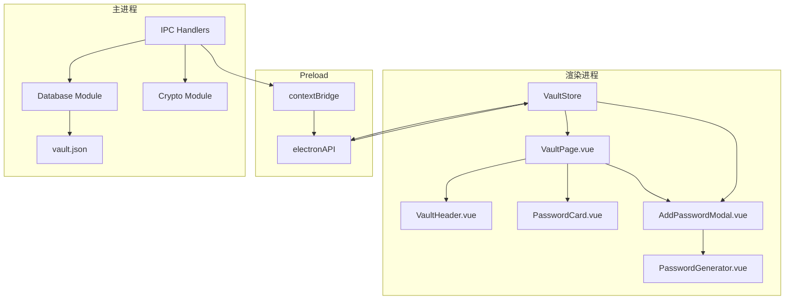
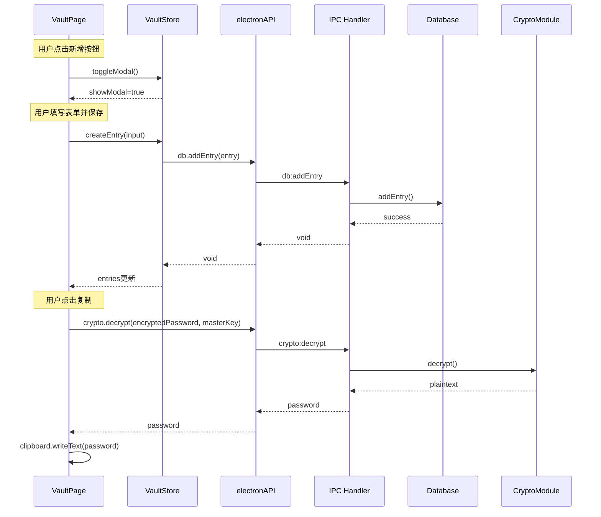
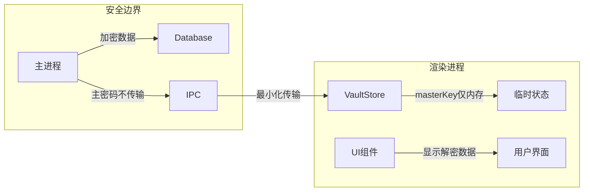
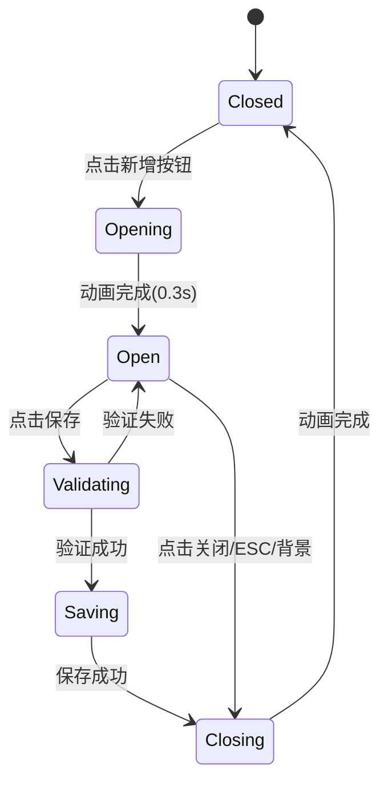
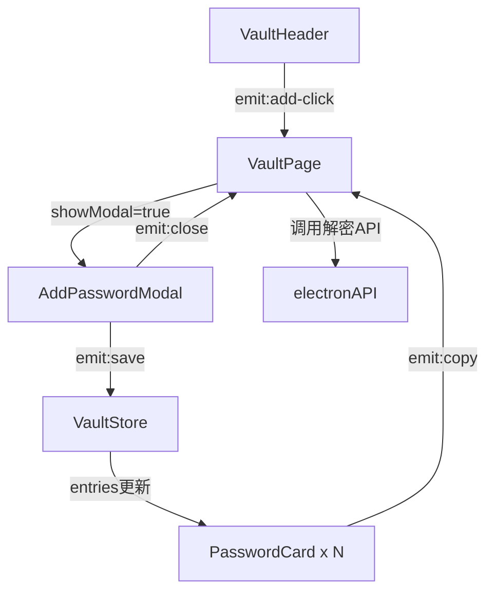

# PassLock 密码库页面 - 系统架构设计

## 架构概览



---

## 模块划分

### 1. 渲染进程模块

#### 1.1 页面组件层级

```
src/components/
├── VaultPage.vue          # 密码库主页面容器
│   ├── VaultHeader.vue    # Header区域 (Logo + 标题 + 新增按钮)
│   ├── PasswordCard.vue   # 密码卡片组件
│   └── AddPasswordModal.vue # 新增密码弹窗
│       └── PasswordGenerator.vue # 密码生成器子组件
```

#### 1.2 组件职责定义

| 组件 | 职责 | 状态依赖 |
|------|------|----------|
| VaultPage.vue | 页面容器，管理卡片网格布局、弹窗状态 | VaultStore.entries, VaultStore.isUnlocked |
| VaultHeader.vue | Header展示、新增按钮点击触发 | 无本地状态，触发父组件事件 |
| PasswordCard.vue | 单个密码条目展示、复制按钮交互 | 接收entry prop，本地复制状态 |
| AddPasswordModal.vue | 新增弹窗表单管理、验证、保存 | 本部表单状态，调用VaultStore |
| PasswordGenerator.vue | 密码生成器面板、配置选项 | 本地生成配置状态 |

#### 1.3 状态管理扩展

**VaultStore 新增状态与方法**：

```typescript
// 新增状态
const showModal = ref(false)           // 新增弹窗显示状态
const searchQuery = ref('')            // 搜索关键词
const copiedEntryId = ref<string | null>(null) // 最近复制的条目ID

// 新增计算属性
const filteredEntries = computed(() => {
  if (!searchQuery.value) return entries.value
  const query = searchQuery.value.toLowerCase()
  return entries.value.filter(e => 
    e.title.toLowerCase().includes(query) ||
    e.site?.toLowerCase().includes(query) ||
    e.username.toLowerCase().includes(query)
  )
})

// 新增方法
async function createEntry(entry: NewEntryInput): Promise<VaultEntry>
async function copyPassword(entryId: string): Promise<void>
function toggleModal(): void
```

---

### 2. 主进程模块

#### 2.1 现有模块职责

| 模块 | 文件 | 职责 |
|------|------|------|
| Database | `electron/database.ts` | 数据持久化 (lowdb + JSON) |
| Crypto | `electron/crypto.ts` | 加密/解密/密码生成 |
| Main | `electron/main.ts` | IPC处理、窗口管理 |
| Preload | `electron/preload.ts` | 安全IPC桥接 |

#### 2.2 数据流设计



---

## 数据结构设计

### VaultEntry 扩展定义

根据UI设计规范，扩展现有 VaultEntry 结构：

```typescript
export interface VaultEntry {
  id: string                // UUID
  title: string             // 名称 (必填) - 原name字段
  username: string          // 用户名 (可选)
  password: string          // 加密后的密码 (必填)
  site?: string             // 网站/应用名称 (新增)
  url?: string              // 网站URL (可选)
  notes?: string            // 备注 (可选)
  icon?: string             // 图标标识 (新增，预留)
  createdAt: number         // 创建时间戳
  updatedAt: number         // 更新时间戳
}

// 新增密码输入类型 (未加密)
export interface NewEntryInput {
  title: string
  username?: string
  password: string          // 明文密码
  site?: string
  url?: string
  notes?: string
}
```

### 数据存储策略

**现有存储方案分析**：
- 当前：密码以加密形式存储在 `vault.json`
- 加密：使用主密码作为密钥，AES-256-GCM加密
- 策略：延续现有方案，主密码仅存在于渲染进程内存中

**新增条目加密流程**：
1. 用户输入明文密码
2. 调用 `crypto.encrypt(password, masterKey)` 加密
3. 将加密后的密码存入数据库
4. 渲染进程不保存明文密码

---

## API设计规范

### IPC通信协议

**现有API复用**：
- `db:getEntries` - 获取所有条目
- `db:addEntry` - 添加条目
- `db:updateEntry` - 更新条目
- `db:deleteEntry` - 删除条目
- `crypto:encrypt` - 加密密码
- `crypto:decrypt` - 解密密码
- `crypto:generatePassword` - 生成随机密码

**无需新增IPC API**，现有API已覆盖密码库页面所有功能需求。

### 类型定义扩展

扩展 `src/types/electron.d.ts`：

```typescript
// 扩展 VaultEntry 类型
interface VaultEntry {
  id: string
  title: string
  username: string
  password: string
  site?: string    // 新增
  url?: string
  notes?: string
  icon?: string    // 新增
  createdAt: number
  updatedAt: number
}

// 新增输入类型
interface NewEntryInput {
  title: string
  username?: string
  password: string
  site?: string
  url?: string
  notes?: string
}

// 扩展 VaultAPI (可选的高级API)
interface VaultAPI {
  createEntry: (input: NewEntryInput, masterKey: string) => Promise<VaultEntry>
  decryptPassword: (entryId: string, masterKey: string) => Promise<string>
}
```

---

## 密码生成器架构

### 组件设计

```typescript
// PasswordGenerator.vue 组件状态
interface GeneratorState {
  length: number           // 8-32
  lowercase: boolean       // 默认true
  uppercase: boolean       // 默认true
  numbers: boolean         // 默认true
  symbols: boolean         // 默认true
  generatedPassword: string
  strengthLevel: StrengthLevel
}

// 生成流程
1. 用户调整配置
2. 调用 electronAPI.crypto.generatePassword(length, options)
3. 实时计算强度: electronAPI.crypto.getPasswordStrengthLevel(password)
4. 显示预览
5. 点击"使用" -> 填充到父组件表单
```

### 安全考虑

- 密码生成在主进程执行（Node.js crypto模块）
- 使用 `randomBytes` 确保密码随机性
- 不在渲染进程存储生成的密码历史

---

## 安全架构整合

### 数据隔离策略



### 敏感数据流规则

| 数据类型 | 存储位置 | 传输规则 |
|----------|----------|----------|
| 主密码 | 仅渲染进程内存 | **绝不通过IPC传输** |
| 加密密码 | 数据库 (主进程) | 可通过IPC传输 |
| 明文密码 | 临时解密 | 仅解密时传输，用后即弃 |
| 条目元数据 | 数据库 | 可通过IPC传输 |

### 复制功能安全设计

```typescript
// 复制密码流程
async function handleCopyPassword(entry: VaultEntry) {
  // 1. 解密密码 (IPC调用)
  const plaintext = await electronAPI.crypto.decrypt(
    entry.password, 
    vaultStore.masterKey
  )
  
  // 2. 写入剪贴板 (渲染进程)
  await navigator.clipboard.writeText(plaintext)
  
  // 3. 清理本地引用 (不存储plaintext)
  // plaintext变量在函数结束后自动释放
  
  // 4. 设置复制状态反馈
  copiedEntryId.value = entry.id
  setTimeout(() => copiedEntryId.value = null, 1500)
}
```

---

## 交互状态管理

### 弹窗状态流



### 卡片交互状态

```typescript
// PasswordCard.vue 本地状态
const isHovered = ref(false)
const isCopied = ref(false)
const showCopiedTooltip = ref(false)

// 状态切换
function onCopyClick() {
  isCopied.value = true
  showCopiedTooltip.value = true
  // 1.5秒后恢复
  setTimeout(() => {
    isCopied.value = false
    showCopiedTooltip.value = false
  }, 1500)
}
```

---

## 组件通信方案

### 事件流设计



### Props & Emits 定义

**PasswordCard.vue**：
```typescript
props: {
  entry: VaultEntry    // 条目数据
}
emits: {
  'copy-password': (entryId: string) => void
  'edit-entry': (entryId: string) => void  // 预留
  'delete-entry': (entryId: string) => void // 预留
}
```

**AddPasswordModal.vue**：
```typescript
props: {
  visible: boolean     // 显示状态
}
emits: {
  'close': () => void
  'save': (entry: NewEntryInput) => void
}
```

**PasswordGenerator.vue**：
```typescript
props: {
  // 无props，作为子组件嵌入
}
emits: {
  'use-password': (password: string) => void
}
```

---

## 技术选型说明

| 需求 | 技术选择 | 理由 |
|------|----------|------|
| 状态管理 | Pinia | 已有架构，响应式、类型安全 |
| 组件框架 | Vue 3 Composition API | 已有架构，逻辑复用性好 |
| 数据存储 | lowdb + JSON | 已有架构，轻量级、Electron友好 |
| 加密算法 | AES-256-GCM | 已有架构，高安全性 |
| IPC桥接 | contextBridge | Electron安全标准 |
| 剪贴板 | navigator.clipboard | Web标准API，Electron支持 |

---

## 响应式架构适配

### 布局响应策略

```typescript
// VaultPage.vue 响应式布局
const cardColumns = computed(() => {
  const width = window.innerWidth
  if (width >= 1200) return 4
  if (width >= 1024) return 3
  if (width >= 640) return 2
  return 1
})

// CSS Grid 动态配置
const gridStyle = computed(() => ({
  gridTemplateColumns: `repeat(${cardColumns.value}, 260px)`,
  gap: cardColumns.value >= 4 ? '20px 24px' : '12px 16px'
}))
```

---

## 输出产物清单

1. **架构文档**: `.agents/docs/architecture/system-architecture.md`
2. **API规范**: `.agents/docs/api-design/api-spec.md` (待输出)
3. **类型扩展**: 需更新 `src/types/electron.d.ts`
4. **Store扩展**: 需更新 `src/stores/vault.ts`

---

## 下游传递

**呼叫 Developer Agent**：
- 传递架构文档路径
- 传递API规范路径
- 实现要求：
  - 创建 VaultPage.vue 及子组件
  - 扩展 VaultStore
  - 更新类型定义
  - 实现密码生成器组件

**无需呼叫 Cryptographer Agent**：
- 加密方案已完善，无需新增
- 现有 crypto module 已覆盖密码生成需求

---

*设计完成时间: 2026-04-06*
*架构师Agent: architect*